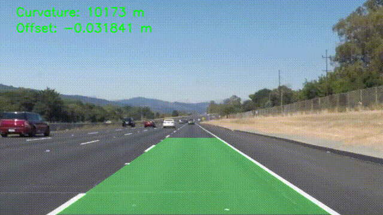
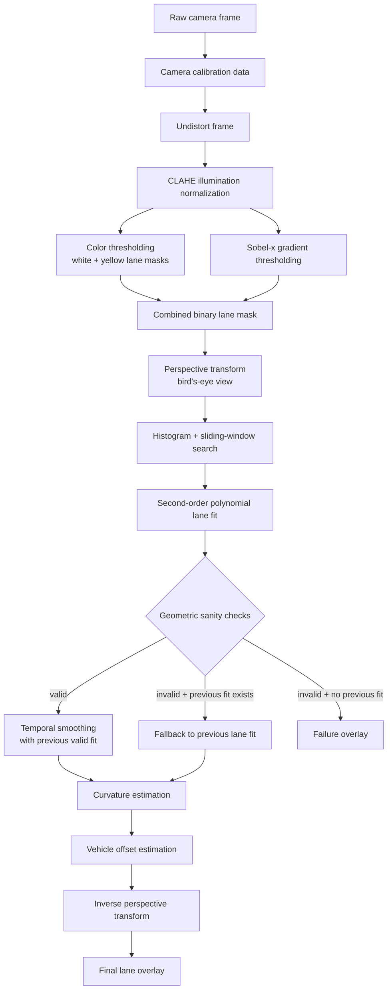
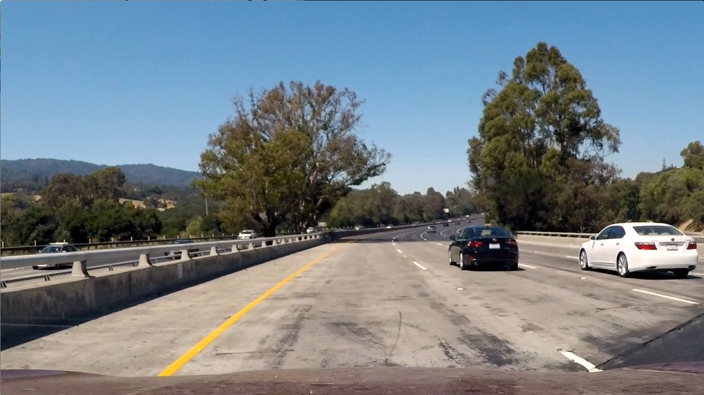
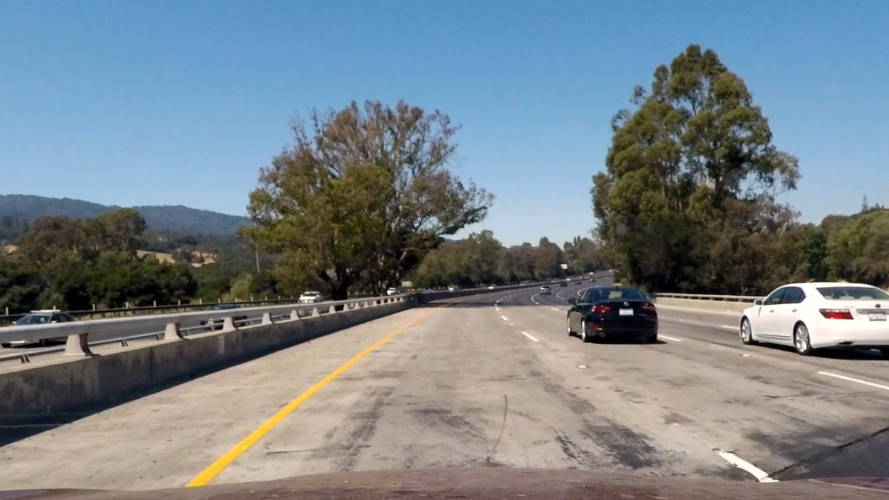
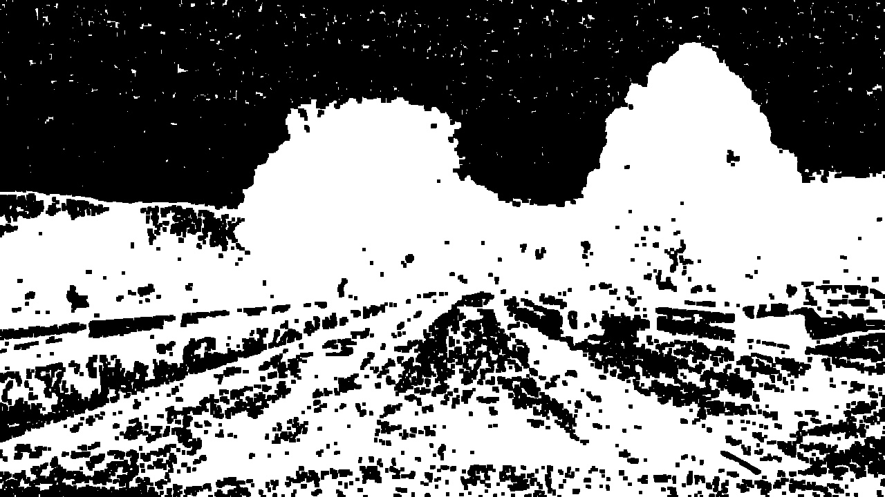
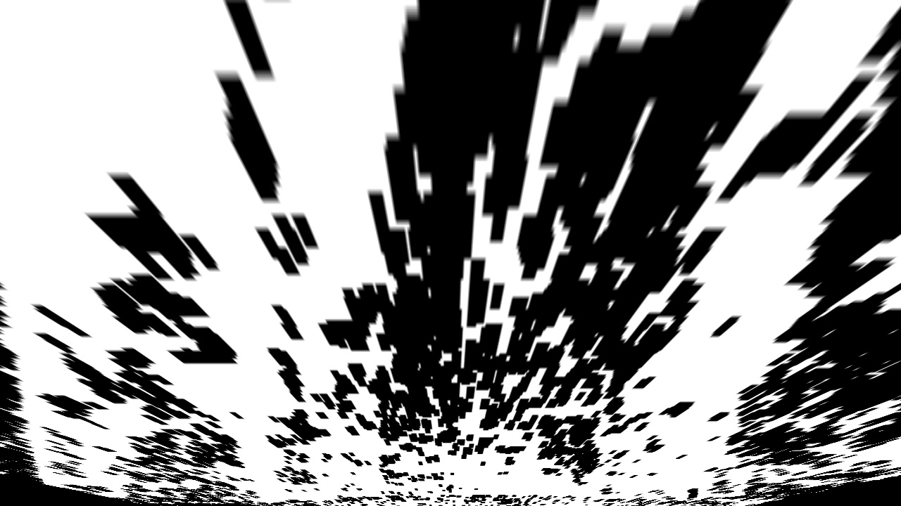
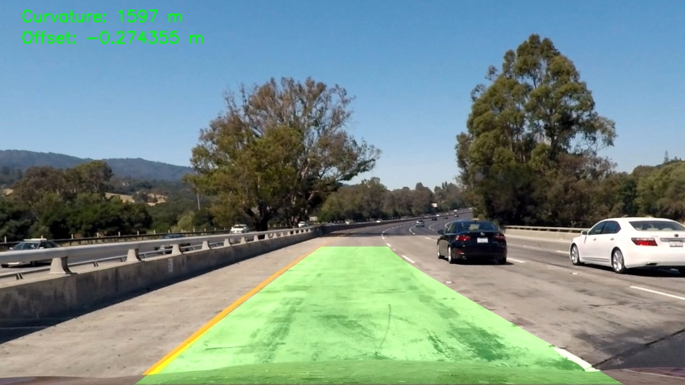

# Lane Detection and Vehicle Offset Estimation Pipeline

C++/OpenCV lane detection pipeline that performs camera calibration, undistortion, lane-mask generation, perspective transformation, polynomial lane fitting, curvature estimation, and vehicle offset tracking.

The project demonstrates a classical computer vision perception pipeline similar to the early stages of an autonomy camera-processing stack.

## Demo

The demo below shows the processed video output with the detected lane area, estimated curvature, and vehicle offset overlaid on each frame.



## Features

- Camera calibration from chessboard images
- Lens distortion correction
- CLAHE-based illumination normalization for improved thresholding under shadows
- White/yellow lane color thresholding
- Sobel-x gradient edge detection
- Perspective transform to bird's-eye view
- Histogram + sliding-window lane pixel search
- Second-order polynomial lane fitting
- Temporal smoothing across video frames
- Geometric sanity checks for implausible lane fits
- Fallback to previous valid lane fit on failed detections
- Lane curvature estimation in meters
- Vehicle lateral offset estimation in meters
- Intermediate debug outputs for pipeline inspection

## Pipeline Overview

The processing flow is:



The source for this diagram is also stored in [`docs/diagrams/pipeline.mmd`](docs/diagrams/pipeline.mmd).

## Camera Calibration

Camera calibration is performed using multiple images of a chessboard pattern.

For each calibration image, chessboard corner points are detected and matched with their corresponding 3D object points, assuming the chessboard lies on a flat planar surface. These 2D–3D point correspondences are used to compute the camera matrix and lens distortion coefficients with OpenCV calibration routines.

The resulting calibration parameters are saved and reused to undistort all subsequent images and video frames before lane detection.

### Undistortion Comparison

The calibration parameters are used to remove lens distortion before lane detection. The comparison below shows the original frame and the corresponding undistorted output.

| Raw frame | Undistorted frame |
|---|---|
|  |  |

## Image Processing Pipeline

### 1. Undistortion

Each input image is first undistorted using the previously computed camera matrix and distortion coefficients. This step reduces lens distortion so that lane geometry can be interpreted more reliably in later stages.

### 2. Binary Thresholding

The thresholding stage is implemented in `thresholdBinary()` in `src/threshold.cpp`.

To highlight lane markings, the pipeline combines color-based and gradient-based masks:

- HLS-based white lane detection
- HSV-based yellow lane detection
- Sobel-x gradient thresholding for strong vertical edges

To improve robustness under shadows and uneven illumination, the thresholding stage applies CLAHE to the HLS lightness channel before generating color and gradient masks. This locally normalizes contrast so lane markings remain more visible in darker road regions while preserving the existing white/yellow lane detection logic.

### 3. Perspective Transform

The binary lane mask is warped into a bird's-eye view using `warpPerspectiveBinary()` in `src/pipeline.cpp`.

The source points define a trapezoidal lane region in the original camera view, while the destination points map that region into a rectangular top-down view. This makes the left and right lane lines appear more vertical and approximately parallel, which simplifies lane pixel detection and polynomial fitting.

The inverse perspective matrix is later used to project the detected lane area back onto the original image.

### 4. Lane Pixel Detection and Polynomial Fitting

Lane detection is implemented in `detectLane()` in `src/lane_detect.cpp`.

The detector:

- computes an x-axis histogram over the bottom half of the warped binary image,
- finds initial left and right lane base positions,
- collects non-zero pixels using `cv::findNonZero`,
- runs a vertical sliding-window search using `nwindows`, `margin`, and `minpix`,
- recenters each window based on the mean x-position of detected lane pixels,
- fits second-order polynomials of the form `x = A*y^2 + B*y + C`,
- applies geometric sanity checks for lane width, lane ordering, width consistency, and curvature-coefficient similarity,
- smooths valid detections using the previous frame fit,
- supports pipeline-level fallback to the previous valid fit when the current detection fails.

### 5. Curvature and Vehicle Offset Estimation

After fitting the left and right lane polynomials, the pipeline estimates:

- lane curvature in meters,
- vehicle lateral offset from the lane center in meters.

Curvature is computed from the fitted polynomial coefficients after converting pixel-space measurements into approximate real-world units. Vehicle offset is computed by comparing the detected lane center near the bottom of the image with the image center, which is treated as the vehicle center.

### Example Curvature and Offset Output

For one processed test frame, the pipeline reports:

| Output | Example value | Meaning |
|---|---:|---|
| Lane curvature | `1597 m` | Estimated radius of curvature of the detected lane. A larger value means the road is closer to straight; a smaller value means a sharper curve. |
| Vehicle offset | `-0.27 m` | Estimated lateral displacement of the vehicle from the lane center. In this project, a negative value means the vehicle is left of the detected lane center, while a positive value means it is right of the lane center. |

These values are approximate geometry estimates derived from the detected lane polynomials. They are intended to provide a useful interpretation of the lane geometry, not high-precision vehicle localization.

## Intermediate Stage Gallery

The following images show the main processing stages for one test frame.

| Stage | Output |
|---|---|
| Undistorted frame |  |
| Binary threshold |  |
| Bird's-eye binary view |  |
| Final lane overlay |  |

## Video Pipeline

The same pipeline can be applied frame-by-frame to video input. For video processing, the project maintains lane state across frames using temporal smoothing and fallback behavior.

If a frame produces an invalid lane fit, the pipeline reuses the previous valid lane fit when available. This prevents a single bad frame from immediately producing a failure overlay and makes the output more stable.


## Robustness Features

The pipeline includes several robustness improvements beyond a basic sliding-window implementation:

### CLAHE Illumination Normalization

CLAHE is applied to the HLS lightness channel before thresholding. This helps lane markings remain visible under shadows and uneven illumination.

### Geometric Sanity Checks

Detected polynomial fits are rejected if they violate expected lane geometry. The checks include:

- left/right lane ordering,
- minimum and maximum lane-width bounds,
- lane-width consistency across the image,
- curvature-coefficient similarity between left and right lane fits.

### Temporal Smoothing

When a previous valid fit exists, the current frame's polynomial coefficients are blended with the previous fit using a configurable smoothing factor. This reduces frame-to-frame jitter in video output.

### Fallback to Previous Fit

If the current frame fails validation but a previous valid lane fit exists, the pipeline reuses the previous fit instead of immediately showing a failure message.

## Key Challenges

This project uses a classical computer vision pipeline, so the quality of the final lane estimate depends strongly on the quality of the binary lane mask and the stability of the fitted lane model.

| Challenge | Affected stage | How it is handled |
|---|---|---|
| Uneven lighting and shadows | Binary thresholding | The thresholding stage applies CLAHE to the HLS lightness channel before generating white/yellow color masks and Sobel-x gradient masks. This improves local contrast in darker road regions, but extreme shadows can still hide lane markings. |
| Worn or partially missing lane markings | Lane pixel detection | The sliding-window search can still fit a lane when enough lane pixels remain visible. However, if too many pixels are missing, the polynomial fit may become unstable and is rejected by geometric sanity checks. |
| Occlusions by vehicles or road objects | Polynomial fitting and validation | Temporary occlusions can interrupt the detected lane pixels. The pipeline reduces visible instability by smoothing valid fits across frames and falling back to the previous valid fit when the current frame fails validation. |
| False positives from road texture or bright objects | Binary thresholding and sanity checks | Color and gradient masks may sometimes detect non-lane features. Geometric sanity checks reject fits with implausible lane width, inconsistent width across the frame, or mismatched left/right curvature. |

## Project Structure

```text
.
├── camera_cal/          # Chessboard calibration images
├── calibration/         # Saved calibration data
├── include/             # Header files
├── src/                 # C++ source files
├── test_images/         # Test input images
├── docs/assets/         # README demo and visual documentation assets
├── run_batch.sh         # Batch script for calibration and sample outputs
├── CMakeLists.txt       # CMake build configuration
└── README.md
```

Main modules:

| File | Purpose |
|---|---|
| `src/main.cpp` | CLI entry point for calibration, image mode, and video mode |
| `src/pipeline.cpp` | Main frame-processing pipeline |
| `src/threshold.cpp` | Binary thresholding and CLAHE preprocessing |
| `src/perspective.cpp` | Perspective transform utilities |
| `src/lane_detect.cpp` | Sliding-window search, polynomial fitting, sanity checks, curvature, and offset helpers |
| `src/calibration.cpp` | Camera calibration and undistortion support |

## Dependencies

This project is written in C++ and uses OpenCV for image processing and computer vision operations.

Required dependencies:

- C++17-compatible compiler
- CMake 3.10 or newer
- OpenCV 4.x

On Ubuntu/Debian-based systems, dependencies can be installed with:

```bash
sudo apt update
sudo apt install build-essential cmake libopencv-dev
```

## Build

Create a clean build directory and compile the project with CMake:

```bash
mkdir -p build
cd build
cmake ..
make
```

Alternatively, from the repository root:

```bash
cmake -S . -B build
cmake --build build
```

The executable is generated inside the `build/` directory.

## Usage

### Camera Calibration

```bash
./build/lane_finding --calibrate
```

This computes the camera calibration parameters from the chessboard images and saves the calibration data for later use.

### Process a Single Image

```bash
./build/lane_finding --image test_images/test1.jpg
```

Generated image outputs are written under `output/`.

### Process a Video

```bash
./build/lane_finding --video input_video.mp4 output_video.avi
```

Example:

```bash
./build/lane_finding --video test_videos/project_video01.mp4 output/videos/overlay/project_video01_out.avi
```

## Batch Run

The repository includes a helper script for running calibration and sample image/video processing:

```bash
bash run_batch.sh
```

## Output Artifacts

When the pipeline is run locally, it can generate intermediate and final outputs such as:

```text
output/images/test1/undistorted.jpg
output/images/test1/binary.jpg
output/images/test1/warped_binary.jpg
output/images/test1/lane_warp.jpg
output/images/test1/lane_unwarped.jpg
output/images/test1/result.jpg
```

The `output/` directory is intentionally ignored by Git. Selected visual assets used by this README are committed separately under `docs/assets/`.

## Limitations

This is a classical computer vision pipeline, so it can still struggle with:

- heavy shadows,
- worn or missing lane markings,
- unusual lane colors,
- strong glare,
- occlusions by vehicles,
- complex road geometry,
- lane merges or exits.

The current implementation improves robustness with CLAHE normalization, geometric validation, temporal smoothing, and fallback behavior, but it is not a replacement for a production-grade autonomy perception system.

## Future Work

Possible improvements include:

- dynamic threshold tuning based on scene brightness,
- stronger shadow-specific masking,
- configurable pipeline parameters,
- test coverage for lane validation logic,
- real-time performance profiling,
- ROS 2 integration,
- camera-device input support,
- learning-based lane segmentation for difficult scenes.

## Why This Project Matters

This project demonstrates the full path from raw camera input to interpretable lane geometry:

```text
camera calibration
→ corrected image
→ lane mask
→ bird's-eye view
→ lane model
→ curvature and offset estimates
→ visual overlay
```

It is intentionally implemented in C++ with OpenCV to show practical computer vision, geometry, and stateful video-processing concepts relevant to camera-based autonomy and embedded perception systems.