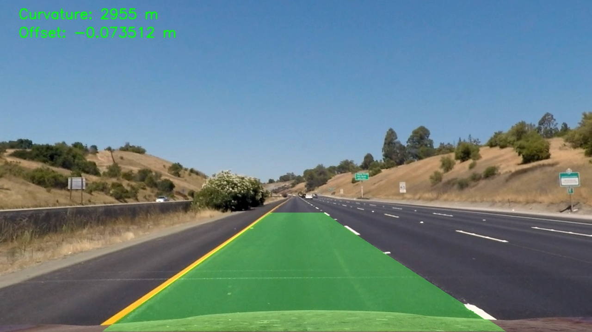
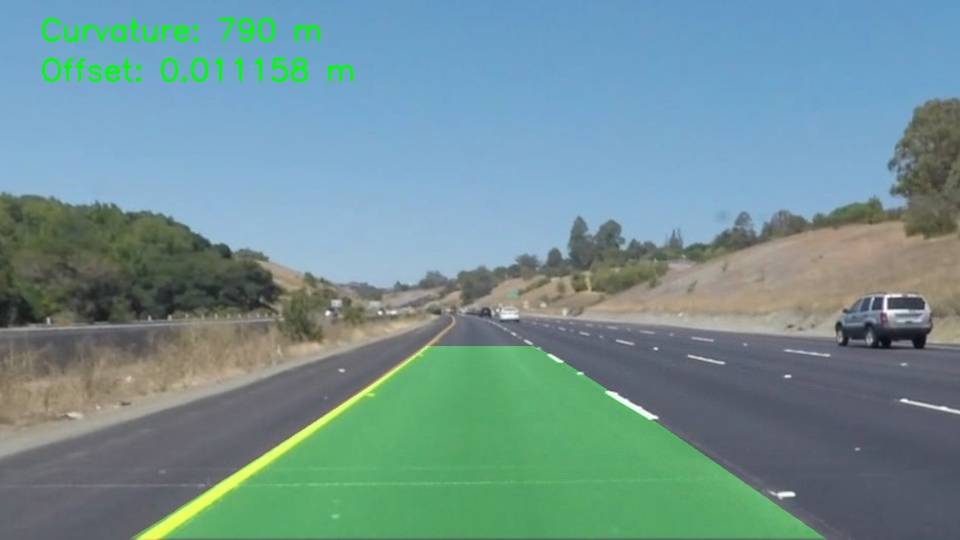
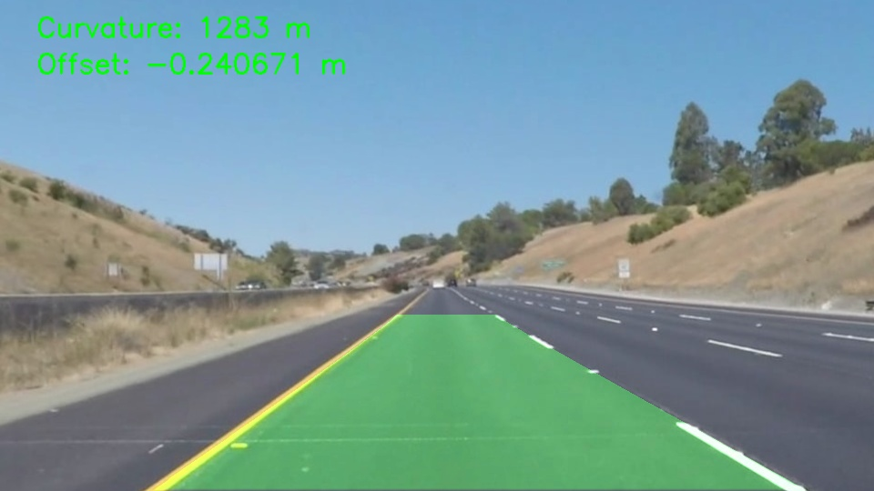
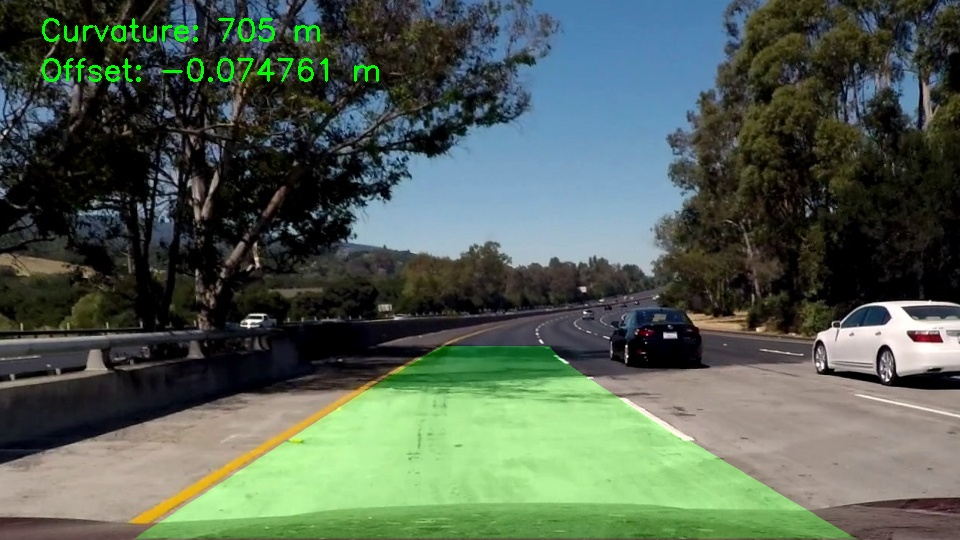

# Results

This page shows representative outputs generated by the lane detection pipeline.

The complete generated `output/` directory is intentionally not committed to the repository. Instead, selected visual assets are copied into `docs/assets/` for documentation.

## Pipeline Stage Outputs

The images below show the main processing stages for one representative test frame.

| Stage | Output |
|---|---|
| Undistorted frame |  |
| Binary lane mask |  |
| Bird's-eye binary view |  |
| Final lane overlay |  |

## Validation Set

The pipeline was tested on still images and videos covering straight lanes, curved lanes, white lane markings, yellow lane markings, lane changes, shadows, and more difficult challenge scenes.

| Category | Inputs | Purpose |
|---|---|---|
| Clean straight lanes | `straight_lines1.jpg`, `straight_lines2.jpg` | Validate perspective transform and stable polynomial fitting |
| Standard test frames | `test1.jpg`–`test6.jpg` | Validate common highway lane-detection cases |
| White lane markings | `solidWhiteCurve.jpg`, `solidWhiteRight.jpg` | Validate white lane thresholding |
| Yellow lane markings | `solidYellowCurve.jpg`, `solidYellowCurve2.jpg`, `solidYellowLeft.jpg` | Validate yellow lane thresholding |
| Lane-change / vehicle case | `whiteCarLaneSwitch.jpg` | Stress-test lane visibility and nearby-vehicle interference |
| Challenging still frames | `challange00101.jpg`, `challange00111.jpg`, `challange00136.jpg` | Stress-test shadows, perspective assumptions, and difficult road appearance |
| Standard videos | `project_video01.mp4`, `project_video02.mp4`, `project_video03.mp4` | Validate frame-by-frame video behavior |
| Challenging videos | `challenge01.mp4`, `challenge02.mp4`, `challenge03.mp4` | Stress-test temporal smoothing, fallback behavior, and threshold robustness |

## Representative Final Outputs

| Case | Output |
|---|---|
| Straight lane |  |
| Yellow curved lane |  |
| Lane-change case |  |
| Challenging still frame |  |

## Video Outputs

The full generated validation videos are stored locally under:

```text
output/videos/validation/
